# Travel Eelam Website

## Description

This website is a travel showcase and guide of my roots, inspired by where my parents were brought up and raised. Each day, I feel so proud to be a part of the Tamil Eelam heritage from the culture to the places and the food. It is an amazing country that is worth the visit. This website is developed and designed for people who want to visit Eelam and learn about our culture,foods and landmarks that still exist today.

### Technologies Used

- HTML
- CSS
- Git/GitHub
- VsCode
- Bootstrap

### Version Control

Git was used throughout the project to keep track to changes and manage development.

I tried to follow a structured commit format approach where possible, using:

- feat: for new features
- fix for bug fixes
- style: for design changes
- docs: for documentation updates

However, not all commits followed this format, as some were written more simply using commits like "add", "update" and "fix". I still made sure all my commits were clear and consise so it was easy to understand what changes were made.

Using version control helped me stay organised during development, track my progress and go back to previous versions.

## How to View the Project

- The site is now live for preview.
  - [View the deployed website HERE](https://thanushsutharsan.github.io/travel-eelam/)

  ### Deployment Procedure
  - This project was deployed using GitHub Pages
  - Steps taken:
    - 1.  Go to repository settings
    - 2.  Select pages
    - 3.  Choose Main Branch
    - 4.  Save to generate live site

## User Experience Design (UXD)

### Overview

This website is designed to provide users with a simple and visual representation of Eelam focusing on culture, food and landmarks.

### Purpose

The purpose of my design is to allow users to easily navigate through the website and gain insights into Tamil Eelam heritage while maintaining a clear and concise visual layout.

### User Stories (Planning section)

#### First-Time Visitor

- As a first time visitor, I want to learn about Tamil Eelam culture from the introduction section so that I understand what the website is all about.
- As a first time visitor, I want to view featured landmarks so that I can see important places in Tamil Eelam.
- As a first time visitor, I want to click the Explore Gallery CTA (Call To Action) Button so that I can easily access and browse a wider collection of images showcasing Eelam.

#### Returning Visitor

- As a returning visitor, I want to browse both food and culture in one placeso that I can easily explore different topics.
- As a returning visitor, I want to access social media links so that I see more conetnt and updates on Eelam.
- As a returning visitor, I want to find a way to sign up easily so that I can stay updated/connected.

#### Frequent visitor

- As a frequent visitor, I want to sign up to the website so tha I stay updated with Travel Eelam.
- As a frequent visitor, I want see consistent layout across all pages so the website easy to navigate around.
- As a frequent visitor, I want to quickly navigate between pages so that I can use the site efficiently.

### User Stories (Evidence section)

The screenshots below show evidence that the user stories from the planning section have been completed in the final website. They are in the same order as the planning section so it's easy to match each one.

#

#### First-Time Visitor

- Introduction section
  - This supports the user story by introducing Tamil Eelam Culture through the main heading and introductory text.

  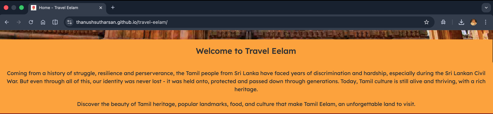

- Featured Landmarks
  - This supports the user story where visitors can view important landmarks in Tamil Eelam, showing multiple fetaured locations in a structured layout.

  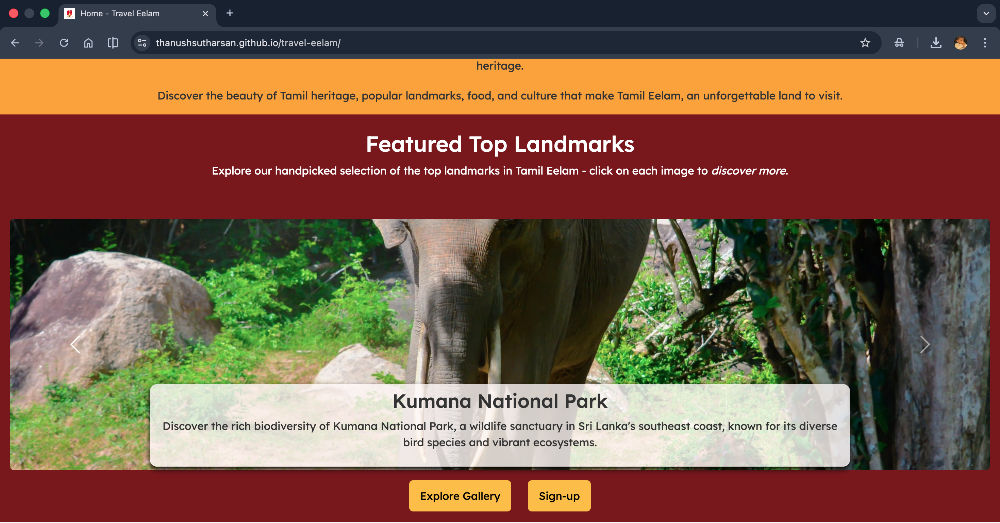

- Explore Gallery CTA Button
  - This supports the user story where the users can easily access the gallery through a clear CTA button.

  

#

#### Returning Visitor

- Food and Culture Gallery
  - This supports the user story by allowing them to browse both food and culture content in one place.

  

- Social Media Links
  - This supports the user story where returning vistors can access social media for more updates and content.

  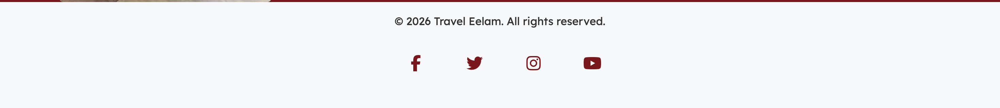

- Sign up button
  - This supports the user story by allowing returning users to easily find the sign-up option.

  

#

#### Frequent visitor

- Sign-up Form
  - This supports the user story to allow frequent visitors to sign up and stay updated with Travel Eelam.

  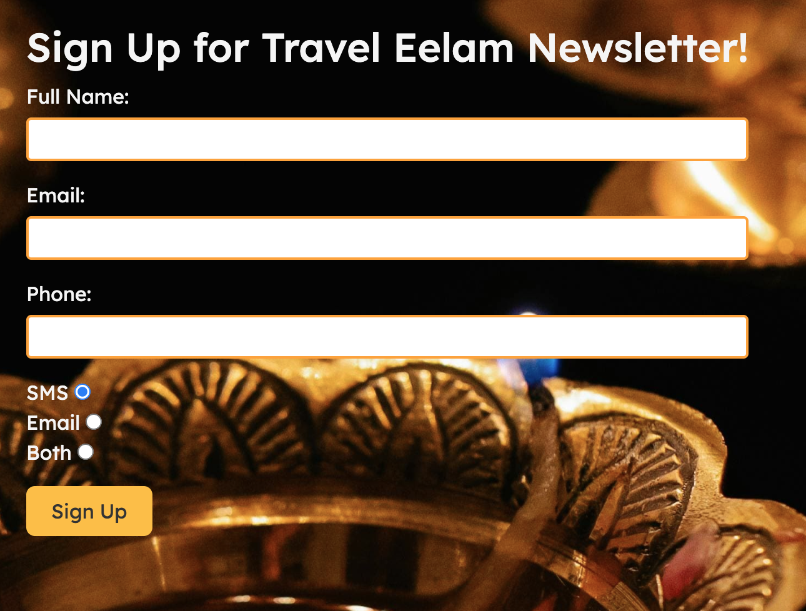

- Consistent Layout Across Pages
  - This supports the user story as it demonstrates consistent layout design with the navbar and footer across all pages ensuring a smooth user experience.

  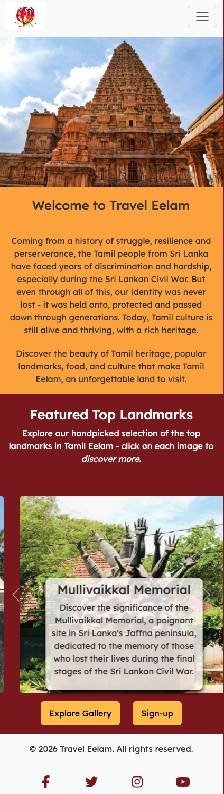

  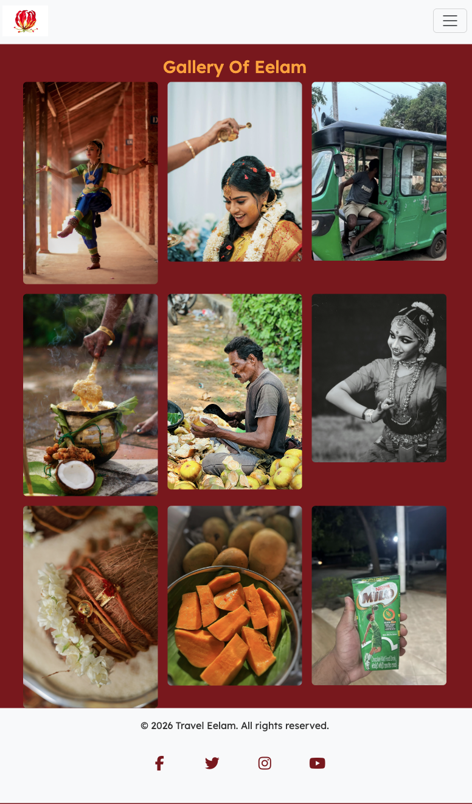

  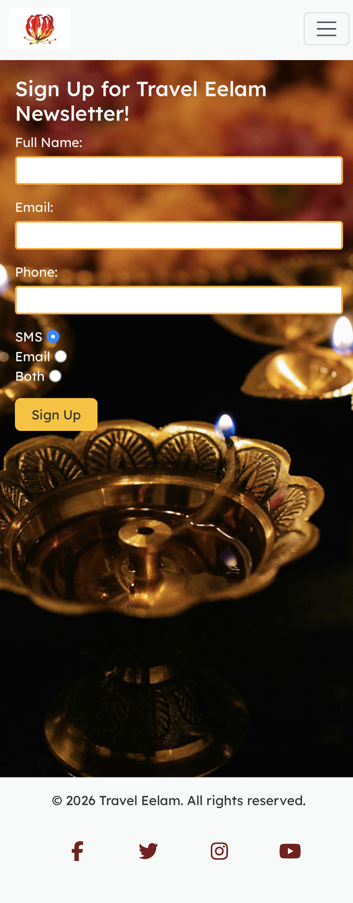

- Navigation bar
  - This supports the user story by providing a clear navigation for efficient browsing.

  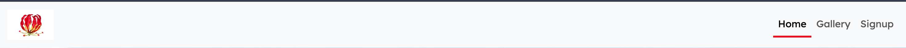

### I. Strategy

#### Target audience

This website is for people interested in travelling around the world, learning different cultures as well as the Tamil community who may not be aware of their heritage, allowing them to reconnect with their roots and to be proud of who they are.

#### Content

The content of the website is relevant and appropriate as it visually shows the culture,food and landmarks of Tamil Eelam via the gallery. Images make the content more engaging as it gives it more visual understanding rather than text overload which enhances user experience eg. so users feel less overwhelmed.

#### Problems and Solutions

One of the problems users face when hearing about Tamil Eelam is that they almost mistake it for India or they just hear that it is an awful place with a lot of slumy areas. This can put a full stop to the users wanting to read about our culture and heritage.

To solve this, I have decided to develop this website showing a more of a accurate and positive representation of what Eelam is.

#### Business Goals

The key concept of the business goal is to create an awareness to the Tamil community and any other users visiting the website to explore and expand their knowledge about Tamil Eelam heritage.

#### User Needs

- Users should be able to move through sections easily through home > gallery > signup.
- Users need the website to work well across all devices.
- Users should be able to quickly learn and explore without feeling overwhelmed.

### II. Scope

#### MVP -(Minimum Viable Product)

- Must have an introduction to the website with a carousel of images showing top featured images and the homepage should have a hero image with a navbar at the top. (Home)
- Must have a gallery page showcasing the culture, food and landmarks using FlexBox (at minimum of 8 images) this will be the second nav-bar on the top after home. (Gallery)
- Must have a sign-up page using a simple form and this should be linked to the third navbar on the top.(Sign-up)
- Must have a footer at the bottom including social links. (Footer)

#### Future developments

- It will have a map for the key places individually rather than the standard click-on the image and you'll be directed towards the place.

- It will have an interactive gallery ie. allowing the users to manually click the image by image basis.

### III. Structure

#### Information Architecture & Logical Organisation of Features

1.  Homepage (index.html) - Logo, Hero Image, Introduction, Carousel, Two CTA (Call to Action Button)
2.  Gallery Page (gallery.html) - Images of culture, food and landmarks.
3.  Sign-Up (signup.html) - A form to sign-up to the monthly newsletter with an image behind it.
4.  Footer - Social links.

#### User Flow

1. Users open the Home Page and see the hero image, then a brief introduction and a CTA button of view the gallery & signup.
2. Users click the CTA button which directs them towards the gallery page or click on the gallery nav bar to browse images of Eelam culture food and landmarks.
3. Users can click the sign up page link in the nav-bar or CTA in the homepage.

### IV. Skeleton

- Wireframes were used to plan each page and give clear visual structure before deploymemt.
- **NOTE**: Some elements are subject to change like the gallery layout as the final images are no available yet. The layout will be ajusted to improve visual appearance across all devices.
- Changes will be recorded with screenshots during the testing stage to show the improvements from the original wire frames designed.

#### Homepage Layout

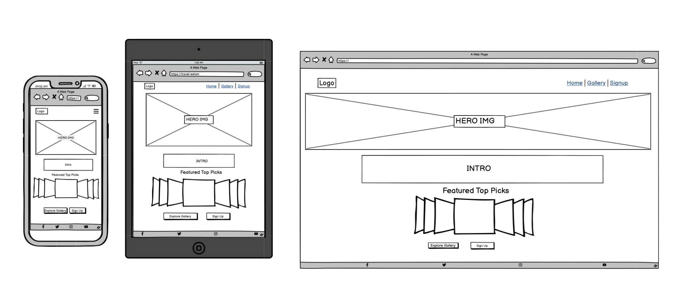

- Header: Logo on the left and navigation on the right
  - Hamburger Menu on mobile.
  - Full Navigation on larger screens.

- Hero Section: Large hero image.

- Introduction: Short description of the website.

- Featured section:
  - Featured Top Picks Title.
  - Carousel Beneath the title.

- CTA Buttons (Call to action) :
  - Explore Gallery
  - Signup

- Footer: Social media links

#### Gallery Page Layout

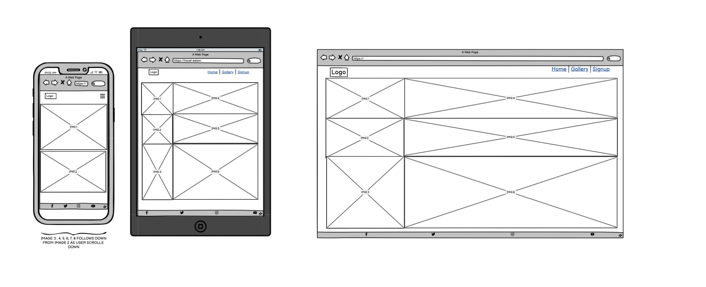

- Header: Same as homepage.
- Main content: Image galllery (Culture,Food,Landmarks) using flexbox to style content.
- Footer: Same as homepage.

#### Signup Page Layout

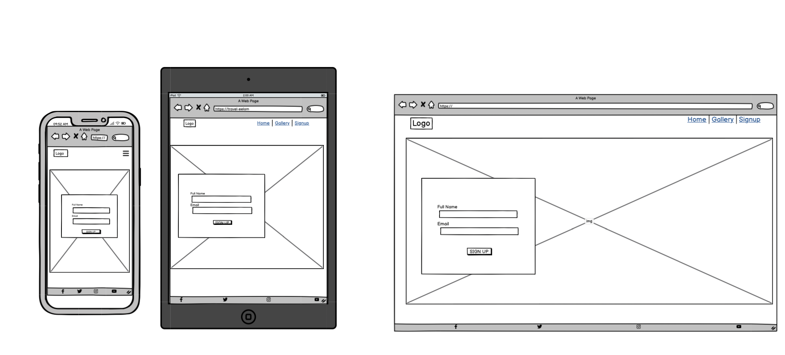

- Header: Same as homepage.
- Main Content: Image behind a form box/page including input and submit button using flexbox to style the form.
- Footer: Same as homepage.

#### Design Points

1. Consistent layout across all pages.
2. Responsive design for mobile, tablet and desktop.
3. Clear placements of buttons, carousel and form for useability.
4. Clear and easy navigation.

#### UX Design Reflection

Some adjustments were made to the original wireframe during development to improve usability and visual presentation :

- **Gallery Page** : The layout was adjusted to accomodate image sizes and ensures the page looks balanced and visually appealing.
  Instead of using a flexbox layout approach, Bootstrap classes were used to define layout and spacing across all devices to ensure responsiveness.

- **Signup Page** : The background box behind the text has been removed to ensure that there was no distracting elements with the background image.

This changes ensured the final website maintained a clear structure, consistent style and user friendly experience.

### V. Surface

#### 1. Colors Scheme

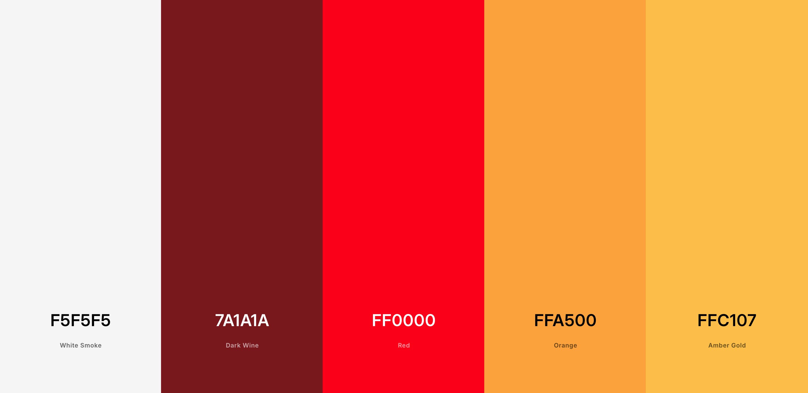

The color scheme for my website was chosen from a color palette using [Coolors](https://coolors.co/f5f5f5-7a1a1a-ff0000-ffa500-ffc107).
Throughout my site, I will maintain a consistent and visually appealing color scheme. The colors reflect the warmth and culture of Tamil Eelam.

- **White Smoke** - #F5F5F5 (Navbar/Footer)- I chose this to keep the website clean, simple, and easy to read for users.
- **Dark Wine** - #7A1A1A (Body background) - I chose this color to create cohesive base for the overall design, adding depth while allowing other elements like images to stand out clearly against it.
- **Bright Red** - #FF0000 (Active Navigation element )- I chose this to clearly show which pages users are on which enhances user experience.
- **Orange** - #FFA500 (Hover state for the Navigation links & introduction section)- I chose this color to provide clear visual feedback on interactive elements,helping users understand when something is clickable.
- **Amber Gold** - #FFC107 (CTA buttons) I chose this to create a strong contrast for CTA buttons to draw users' attention and encourage interactions.

- Text Colors:
  - Black : #000000
  - White : #FFFFFF
  - Default text - #333

  The text colors in accordance to the background so that it is user-friendly.

#### 2. Typography

- Main Font: Lexend
  - I chose this font primarily because it is known to be more accessesible and easier to read compared to other fonts for all users including for people with reading difficulties.

- Fall-back Font: Sans-serif
  - I chose this font to fall back on as it ensures content remains readable if the main font fails to load.

#### 3. Images and Visuals

The images showcased on my website focus on culture,food and landmarks linking the purpose of the site. Each image will have an alt tag to ensure users get better experience even if the image fails to load or for screen readers to be more accessible.

#### 4. Animations and Effects

Simple animations and effects used were learned through course materials such as the LMS and additional independent research, helping to improve the interactivity and user experience of the website.

- **Typewriter Effect**
  - Users will have an visually engaging element.

- **Carousel Silder**
  - Users can scroll through the images easily creating an interactive element.

- **Hover Effects**
  - Users will gain visual feedback when they interact with elements eg.navbar.

#### Homepage - (Branding decision)

I chose not to visibly show the title "Travel Eelam" on the homepage because I wanted the first impression to feel more personal and egaging hence the hero image rather than heavly brand focused instead i've used a welcome message to interact with users creating a more authentic and more inviting an inlusive environment. The branding is kept minimal with only an icon in the top left hand corner in the navbar, allowing users to focus on the visuals of Eelam without any obstuction.

The full Travel Eelam title is still included in the footer minimally to maintain brand indentity and consistentcy across the site.

## Testing

Manual testing was carried out to ensure that the website meets the requirements for:

- Functionality
- Usability
- Responsiveness
- Accessability

Each page of the live site was tested across different screen sizes and browsers to ensure consistency and reliability.

### Manual Testing Table

| Test Case             | Expected Results                                                                 | Initial Outcome | Fix                                                            | Fianl Outcome |
| --------------------- | -------------------------------------------------------------------------------- | --------------- | -------------------------------------------------------------- | ------------- |
| Navigation menu links | All links navigate to correct pages                                              | PASS            | N/A                                                            | PASS          |
| External links        | Opens a new tab                                                                  | PASS            | N/A                                                            | PASS          |
| Gallery Layout        | Images display without any distortion                                            | PASS            | N/A                                                            | PASS          |
| Sign-up Form Input    | Users can enter details correctly                                                | PASS            | N/A                                                            | PASS          |
| CTA Buttons           | Directs users to correct pages                                                   | PASS            | N/A                                                            | PASS          |
| Images                | No Pixelation or stretching and loads quickly                                    | FAIL            | Compressed images                                              | PASS          |
| ALT Text              | Visible alt text when images fail to load                                        | Fail            | Change color of alt text                                       | PASS          |
| Text readability      | High contrast and readable content                                               | PASS            | N/A                                                            | PASS          |
| Bootstrap Components  | Carousel and Gallery Layout function correctly                                   | PASS            | N/A                                                            | PASS          |
| Footer                | All social links & copyright info visible and functional displayed at the bottom | FAIL            | Set page height 100vh to ensure the footer stays at the bottom | PASS          |

### CSS Override Issue -(During Development)

- **Issue** - Custom styles were not displaying correctly.
- **Cause**- Bootstrap CSS overriding Custom CSS.
- **Fix** - Re-order the stylesheets from Bootstrap being at the top and custom css being at the. bottom.
- **Outcome** - Styles are now applied correctly.

### Responsiveness Testing

To check if the website is responsive, the tool [Am I Responsive?](https://amiresponsive.co.uk/) was used. The website was tested on multiple devices with various screen sizes such as mobile, tablet and desktop.

The layout, images and text all adapt correctly to different screen sizes without overlapping and breaking.

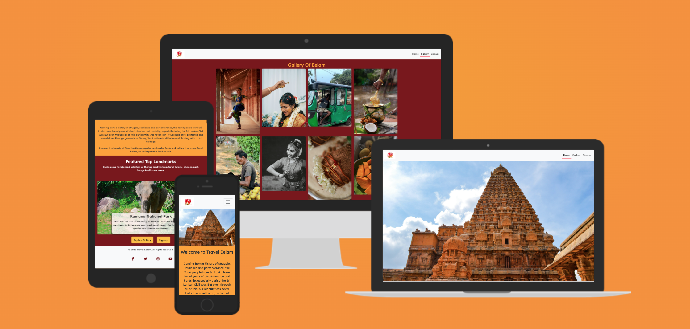

### Deployment Testing

The deployed website was tested using GitHub pages to ensure it matches development version:

- All pages load correctly on the live site
- Navigation works across all pages
- No visual differences between local and deployed versions
- All features such as carousel, CTA buttons and forms functions well as expected.

#### Local Host and GitHub Comparison

**HOME**

**GALLERY**

**SIGNUP**

The screenshots above show the live deployed website on GitHub Pages (on the right), confirming that it matches the local host saved locally(on the left).

### Link Testing

All internal and external links were tested manually:

- No broken links were found
- Navigation between pages works correctly as intended
- External links opens in a new tab as in when required

### Accessibility Testing

The website was tested using Google Lighthouse in Chrome DevTools and achieved high scores in both performance and accessibility, indicating efficient loading times. This screenshot below stands by as evidence for testing.

#### HOME SECTION

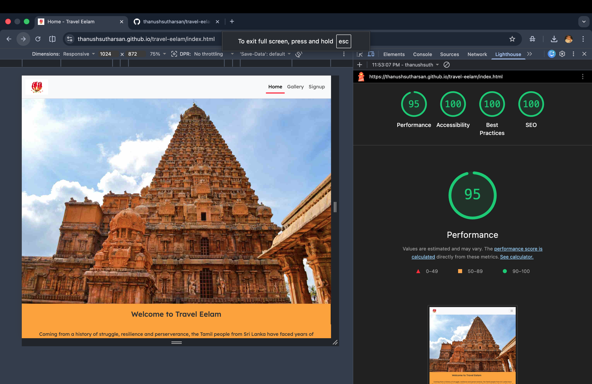

#### GALLERY SECTION

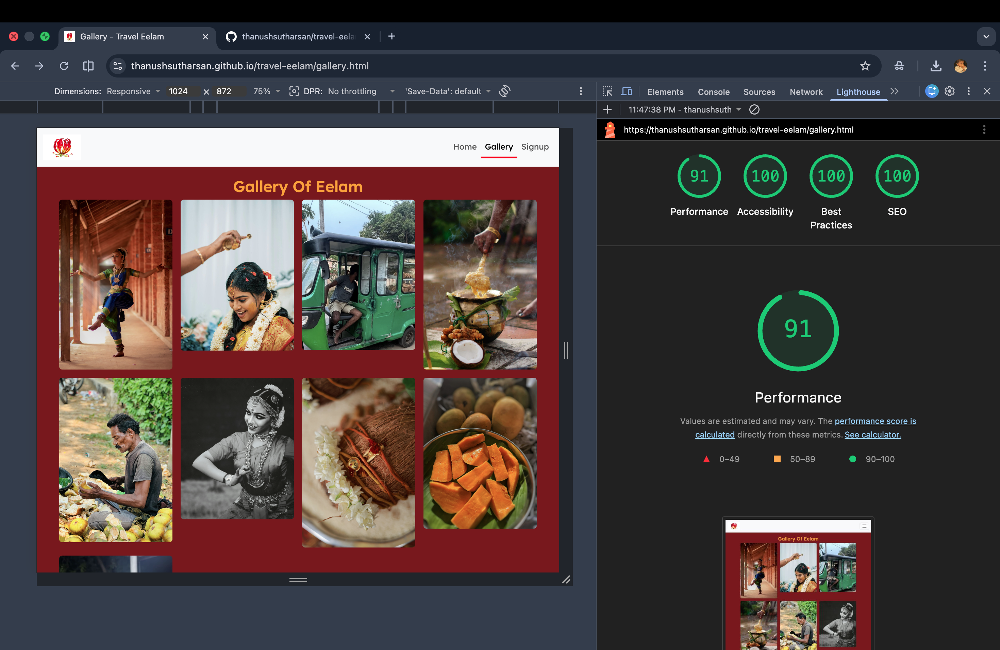

#### SIGNUP SECTION

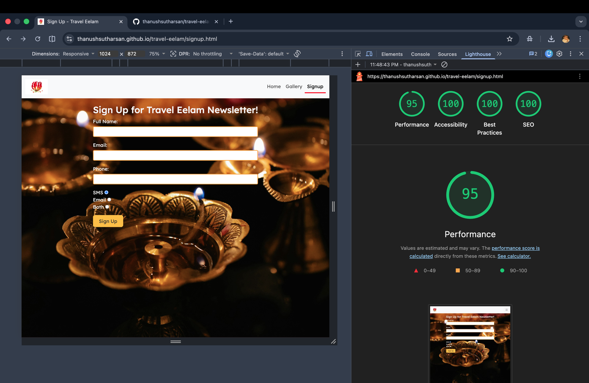

### Code Validation & Clean-up

- All unused and commented out codes were removed before deployment
- All HTML and CSS files were validated with no errors through [W3C HTML validator](https://validator.w3.org) & [W3C CSS validator](https://jigsaw.w3.org/css-validator/)

**Home HTML Validation**

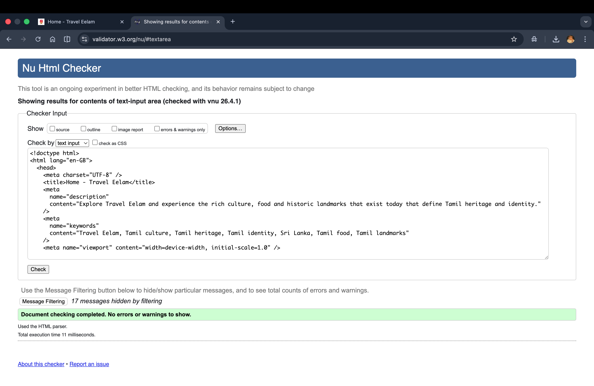

**Gallery HTML Validation**

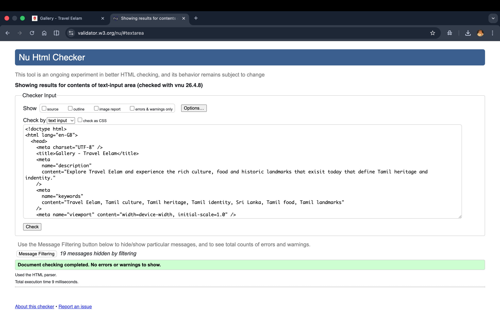

**Signup HTML Validation**

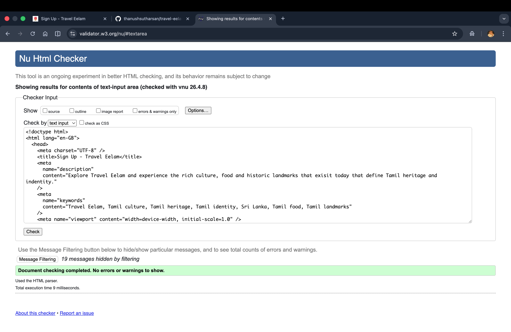

**CSS Validation**

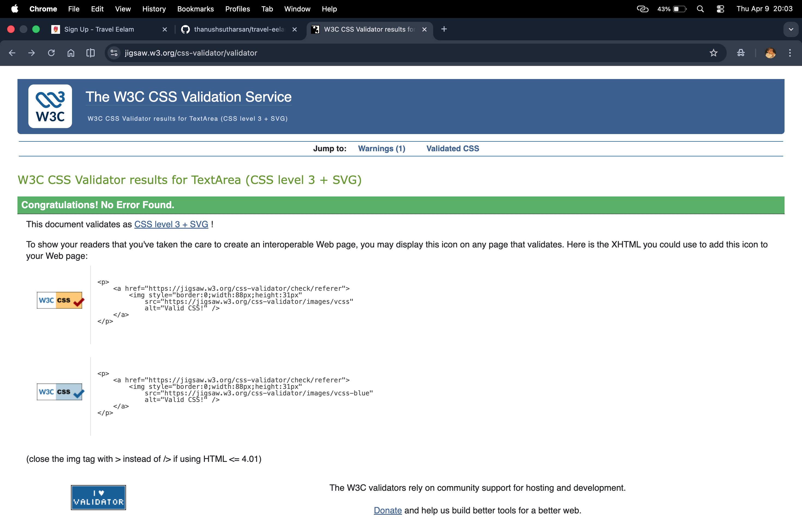

## File Structure

- Travel-eelam
  - assets
    - css
      - style.css
    - favicon
    - images
      - testing
    - wireframes
  - gallery.html
  - index.html
  - README.md
  - signup.html

## Credits

All custom HTML and CSS were written by me (Thanush Sutharsan).

### Code

- [Bootstrap v5.3](https://getbootstrap.com) - used for the responsive layout components such as the navbar, carousel and gallery with significant customisation.

- [Font Awesome](https://fontawesome.com/) - used for the social media icons in the footer with customisation to the color .

- [Formspree](https://formspree.com/) - used for the forms data logging for forms.

### Media

#### Fonts

---

The fonts that are used imported from other sources are linked below:

https://fonts.google.com/specimen/Lexend

#### Images

---

1.  Great Living Chola Temples Under Blue Sky.

- Creator : Vigneshkumar S
- Source: http://www.pexels.com/photo/great-living-chola-temples-under-blue-sky-5138790/
- Licence : Pexels License (Free to use , no attribution required)

---

2.  At Kumana National Park

- Creator: Nadarajah Mauran
- Source:http://upload.wikimedia.org/wikipedia/commons/a/a5/At_Kumana_National_Park.jpg
- License: CC BY-SA 4.0

---

3.  Nallur Kandaswamy Kovil Gopuram, Jaffna

- Creator: Umabathi
- Source:http://upload.wikimedia.org/wikipedia/commons/thumb/b/b2/NallurKandaswamyKovilGopuram.jpg/1280px-NallurKandaswamyKovilGopuram.jpg
- License: CC BY-SA 3.0

---

4. Mannar Fort, Sri-Lanka

- Creator: David Stanley
- Source:http://upload.wikimedia.org/wikipedia/commons/a/a8/Mannar_Fort_%2843350481210%29.jpg
- License: CC BY 2.0

---

5. Mullivaikkal Memorial, Jaffna

- Creator: Tamil Youth Org
- Source:http://commons.wikimedia.org/wiki/File:Mullivaikkal_memorial_Jaffna_prior_to_distruction.png
- License: CC0 (Public Domain)

---

6. Kaniya Hot Springs, Sri-Lanka

- Creator: K. Shayanthan
- Source: http://commons.wikimedia.org/wiki/File:Kanniya_hot_springs.jpg
- License:CC BY-SA 4.0

---

7. South Asian Pregnant Woman being blessed

- Creator: Ali Photographer
- Source:http://www.pexels.com/photo/south-asian-bride-during-pre-wedding-ritual-29226150/
- License: Pexels License (free to use, no attribution required)

---

8. Women in Traditional Clothes Dancing

- Creator:Jidev Mohan
- Source: http://www.pexels.com/photo/woman-in-traditional-clothes-dancing-14469571/
- License: Pexels License (Free to use, no attribution required)

---

9. Bunnis Auto Food (Photo From TikTok Food Video)

- Creator: Original Creator on TikTok @dilanni.k
- Source: http://vm.tiktok.com/ZNRX4DrUA/
- Usage: Educational Purposes Only

---

10. Traditonal Pongal Festival Ritual with a pot

- Creator: Narasimhan AVPL
- Source:http://www.pexels.com/photo/traditional-pongal-festival-ritual-with-pot-30519624/
- License: Pexels License (free to use, no attribution required)

---

11. Coconut Vendor Preparing Fresh Coconut Outdoors

- Creator: Anurag Gusain
- Source:http://www.pexels.com/photo/coconut-vendor-preparing-fresh-coconuts-outdoors-31919226/
- License: Pexels License (free to use, no attribution required)

---

12. Woman Wearing Traditional Jewellery

- Creator: Adhwaith Chandran
- Source: http://www.pexels.com/photo/woman-wearing-indian-traditional-jewelry-15586068/
- License: Pexels License (free to use, no attribution required)

---

13. Close-up thaali shot

- Creator: BANU FILM ADS
- Source: http://www.pexels.com/photo/close-up-mangalsutra-on-a-coconut-during-a-traditional-south-indian-wedding-ceremony-27060278/
- License: Pexels License (free to use, no attribution required)

---

14. Mango Cut-up

- Creator: SHVETS Production
- Source: http://www.pexels.com/photo/17104940/
- License:Pexels License (free to use, no attribution required)

---

15. Milo (Photo from TikTok video)

- Creator: Original creator on TikTok @shanjixr
- Source: http://vm.tiktok.com/ZNRX4kgva/
- Usage: Educational Purposes Only

---

16. Close up of traditional lamp

- Creator: Lara Jameson
- Source :http://www.pexels.com/photo/close-up-of-traditional-tableware-for-ceremony-8887303/
- License: Pexels License (free to use, no attribution required)

---

17. Karthikyai Povu (Art from Instagram)

- Creator: Illustration by Keera Ratnam (@wavesofcolour on Instagram)
- Source: http://www.tamilguardian.com/content/searching-security
- Usage: Educational purposes only
